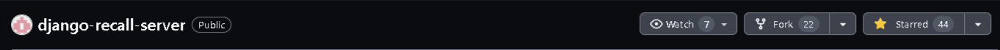

# Django Recall Server.

A Django server for managing the verification of constituents, publishing of representative information, and signing to recall them.
 

Want to contribute? Get started with Gitpod by clicking the button below

  

 

> \[!IMPORTANT]
>
> Star us to show your support and love for django recall server.⭐️

### About Repo

- This repo hosts the open-source server powering Public Gavel.
- It exposes APIs to facilitate verification and registration of constituents in a credible and secure way.

### Stack

- Django Rest framework
- PostgreSQL
- Docker
- JWT

### Code of Conduct

We adhere to the Contributor Covenant Code of Conduct. Please read [CODE_OF_CONDUCT.md](CODE_OF_CONDUCT.md) for more information.

### 🙌 Want to Contribute?

Your contribution is highly valued. Before getting started kindly go through [CONTRIBUTING.md](CONTRIBUTING.md) for a better understanding of the project.

We are open to all kinds of contributions. If you want to:

- 🤔 Suggest a feature
- 🐛 Report an issue
- 📖 Improve documentation
- 👨‍💻 Contribute to the code

## Join the Community

- [Discord server](https://discord.gg/ZyCfgAQ6)
- [Twitter]()

## 🙏 Thanks to all Contributors
Thanks a lot for spending your time in helping Django Reacall Server grow. Thanks a lot! ❤️
 <a href = "https://github.com/Friendsofthepeople/django-recall-server/graphs/contributors">  
   
 </a>

## License

This project is licensed under the MIT License. See the [LICENSE](LICENSE) file for more details.

Happy hacking with you!
